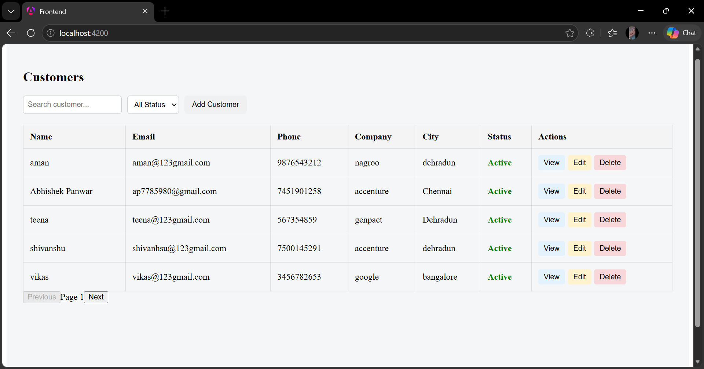
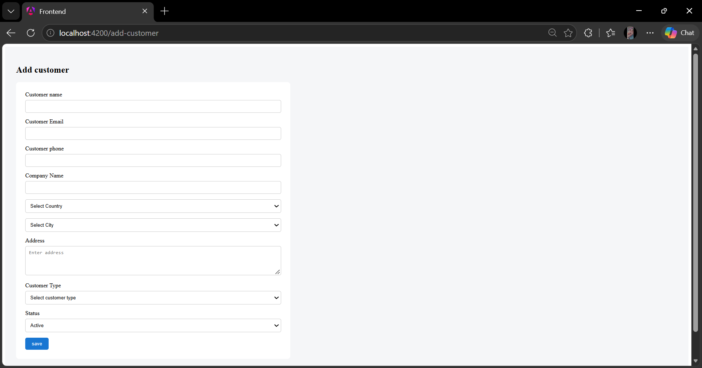
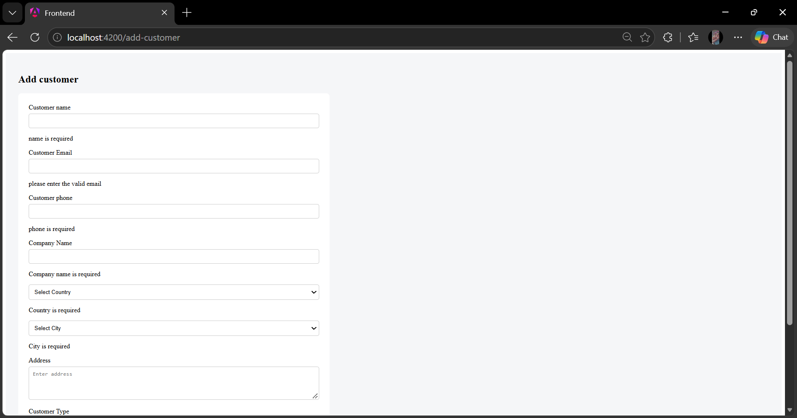
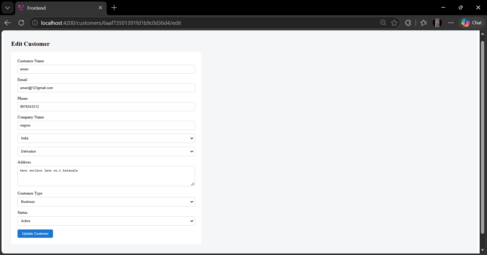
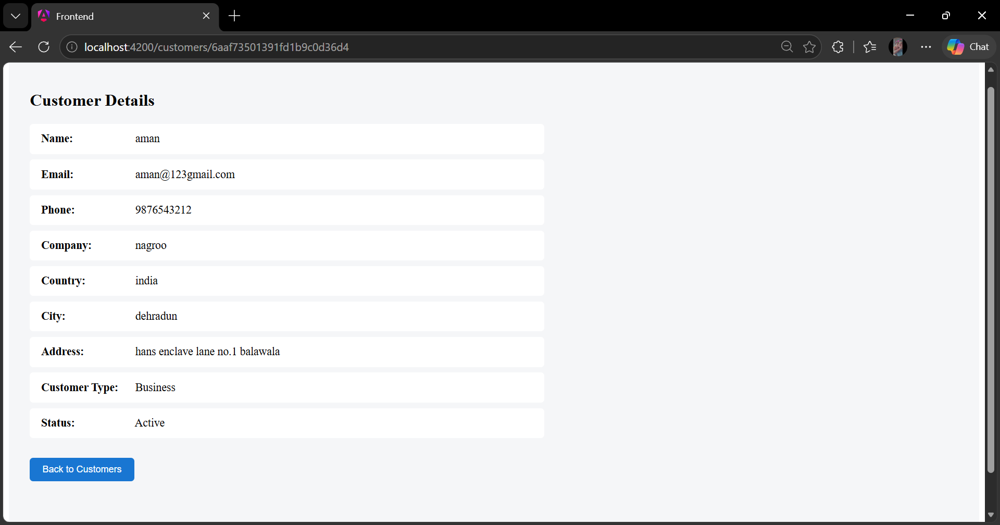
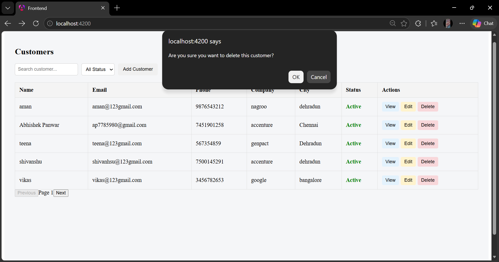

# Customer Management System

A full-stack Customer Management System built using Angular, Node.js, Express.js and MongoDB.

## Features

- Customer listing
- Search customers by name, email or company
- Filter customers by status
- Add new customer
- Edit customer
- View customer details
- Delete customer with confirmation
- Form validation
- Country and City dropdowns
- Loading state
- Empty/no-data state
- Error state
- Frontend pagination
- Angular routing
- REST API integration
- MongoDB database

## Tech Stack

### Frontend
- Angular
- TypeScript
- HTML
- CSS
- Reactive Forms
- Angular Router
- HttpClient

### Backend
- Node.js
- Express.js
- MongoDB
- Mongoose

## Project Structure

```text
customer-management/
│
├── backend/
│   ├── controllers/
│   ├── models/
│   ├── routes/
│   ├── .env
│   └── server.js
│
└── frontend/
    └── src/
        └── app/
            ├── components/
            ├── services/
            ├── app.config.ts
            ├── app.routes.ts
            └── app.component.ts

            ├── app.routes.ts
            └── app.component.ts
```

## What I Learned

While building this project, I learned how to build a complete CRUD application using Angular and integrate it with a Node.js and Express.js REST API.

Key things I learned:

- Angular components and routing
- Angular Reactive Forms and form validation
- Angular services and dependency injection
- HTTP API integration using HttpClient
- Working with Observables
- CRUD operations with REST APIs
- Connecting Angular frontend with Node.js backend
- MongoDB and Mongoose integration
- Search, filtering and pagination
- Handling loading, empty and error states
- Debugging frontend and backend integration issues

## Challenges Faced

Some challenges I faced during development were:

- Learning Angular concepts and syntax as I was new to Angular.
- Connecting the Angular frontend with the Express.js REST API.
- Handling form validation correctly.
- Prefilling data while editing an existing customer.
- Handling different capitalization of Country and City values from the database.
- Implementing search, filtering and frontend pagination.
- Handling different UI states such as loading, empty data and API errors.

These challenges helped me understand Angular practically and improve my debugging and problem-solving skills.

## Screenshots

### Customer List



### Add Customer



### Form Validation



### Edit Customer



### View Customer



### Delete Confirmation

